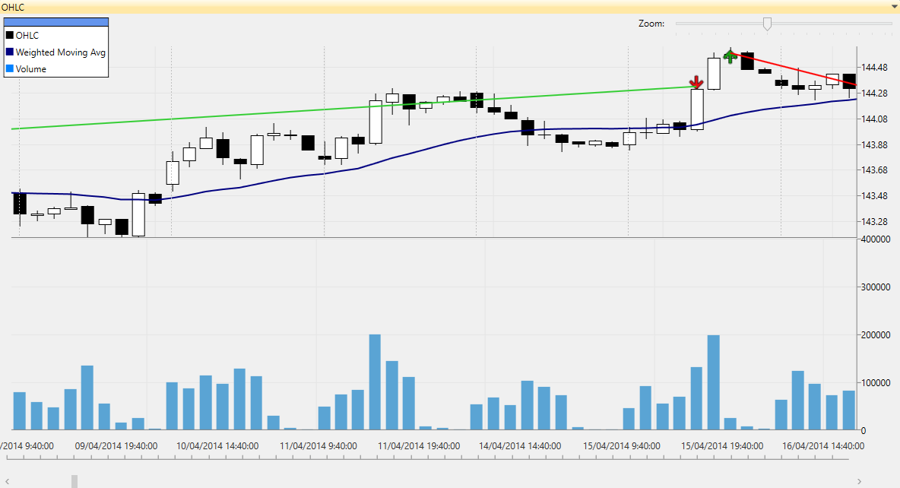
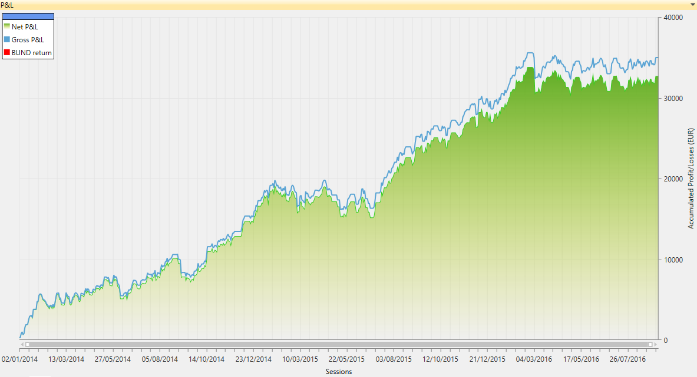

Sansa Trading Strategy
============================================

Table of Contents
----

* [Overview](#overview)
* [Sansa Trading Rules](#Sansa-trading-rules)
* [Download](#download)
* [Quick Start](#quick-start)
* [User Manual](#user-manual)
* [About iSystems](#about-isystems)
* [Disclaimer](#disclaimer)

Overview
----

Sansa is a trading algorithm written in C# using the [TradingMotion SDK] development tools (there is a [VB.net port] too).


<sub>__Image footnote:__ Example of Sansa OHLC financial chart showing some automatic trades</sub>

The strategy code is all contained in [SansaStrategy.cs], including a default parameter combination.

This default parameter combination has been optimized to run over a 100' bars main chart and 120' bars secondary chart of _Euro-Bund Future_.

Trading a maximum of 1 contract of Euro-Bund Future, this is how performed (hypothetically) from 2001 to 2016:


<sub>__Image footnote:__ Hypothetic Net P&L chart for Sansa strategy</sub>

Anyway, go open Visual Studio, clone the project and start with the trading algo development! Sure you can do better and improve all these figures :)

Sansa Trading Rules
----

Sansa's trading plan is quite simple. It __buys 1 contract__ when the weighted moving average short period of seconday chart breaks above the weighted moving average long period of main chart.

While Sansa has a position in the market, it __places two exit orders__. A _Stop Loss_ order and a _Take Profit_. 

### To sum up ###
```
Sansa Trading Strategy rules:

  * Entry: Weighted moving average short period (secondary chart) breaks above the weighted moving average long period (main chart).
  * Exit: Set a fixed Stop Loss and a Take Profit (objective)
  * Filters: None
```

### Show me the code ###

Here is a simplified C# source code of Sansa's _OnNewBar()_ function. The complete code is all contained in [SansaStrategy.cs] along with comments and definition of parameters.

```VB.net
Dim indFastSma As WMAIndicator = GetSecondaryChart(0).GetIndicator("Fast WMA")
Dim indSlowSma As WMAIndicator = GetIndicator("Slow WMA")

If GetOpenPosition() = 0 Then

    If indFastSma.GetWMA()(0) > indSlowSma.GetWMA()(0) And _
        indFastSma.GetWMA()(1) < indSlowSma.GetWMA()(1) Then
        'Check if Fast weighted moving average is higher than Slow moving average in current bar, and
        'Check if Fast weighted moving average was lower than Slow moving average in previous bar

        'Going Long (Buying 1 Contract at Market price)
        Buy(OrderType.Market, 1, 0, "Open long position")
    End If

End If

'Place Take-Profit and Stop-Loss orders
PlaceExitOrders()

Protected Sub PlaceExitOrders()
    If GetOpenPosition() > 0 Then

        Dim ticksTakeProfit As Integer = GetInputParameter("Ticks Take-Profit")
        Dim ticksStopLoss As Integer = GetInputParameters("Ticks Stop-Loss")

        Dim takeProfitLevel As Double = GetFilledOrders()(0).FillPrice + (ticksTakeProfit * Symbol.TickSize)
        Dim stopLossLevel As Double = GetFilledOrders()(0).FillPrice - (ticksStopLoss * Symbol.TickSize)

        ExitLong(OrderType.Limit, Symbol.RoundToNearestTick(takeProfitLevel), "Take Profit")
        ExitLong(OrderType.Stop, Symbol.RoundToNearestTick(stopLossLevel), "Stop Loss")

    End If
End Sub
```

Download
----

First of all, make sure you have Visual Studio 2010 version (or higher). [TradingMotion SDK] is fully compatible with [Visual Studio Express] free versions.

Download TradingMotion [Visual Studio extension], and the windows desktop application [TradingMotionSDK Toolkit installer].


Quick Start
----

* Create a free account to access TradingMotionAPI (required). It can be created from TradingMotionSDK Toolkit (the desktop application)
* Clone the repository:
```sh
git clone https://github.com/victormartingarcia/sansa-trading-strategy-csharp
```
* Open Visual Studio and load solution _SansaStrategy/SansaStrategy.sln_
* Edit _app.config_ file adding your TradingMotionAPI credentials on _appSettings_ section

And you're all set!

Running the project (F5) will perform a _development backtest simulation_ over last 6 months DAX 60' bars data.

Once it has finished, it will ask if you want to see the P&L report in TradingMotionSDK Toolkit. Pressing 'y' will load the same backtest with the desktop app, where it will show performance statistics, charts, and so on.

User Manual
----

__[More documentation in the Getting Started Guide]__

About iSystems
----

[iSystems] by [TradingMotion] is a marketplace for automated trading systems.

_iSystems_ has partnered with [11 international brokers](http://www.tradingmotion.com/Brokers) (and counting) that offer these trading systems to their clients (both corporate and retail) who pay for a license fee that the developer charges.

The trading systems run with live market data under a controlled environment in iSystems' datacenters.

This way the developers just need to worry about how to make their trading systems better and iSystems platform does the rest.

Visit [Developers] section on TradingMotion's website for more info on how to develop and offer your systems.

Disclaimer
----

I am R&D engineer at [TradingMotion LLC], and head of [TradingMotion SDK] platform. Beware, the info here can be a little biased ;)

  [VB.net port]: https://github.com/victormartingarcia/arya-trading-strategy-vbnet
  [TradingMotion SDK]: http://sdk.tradingmotion.com
  [SansaStrategy.cs]: SansaStrategy/SansaStrategy.cs
  [iSystems platform]: https://www.isystems.com
  [iSystems.com]: https://www.isystems.com
  [iSystems]: https://www.isystems.com
  [TradingMotion LLC]: http://www.tradingmotion.com
  [TradingMotion]: http://www.tradingmotion.com
  [Developers]: http://www.tradingmotion.com/Strategies/Developers
  [Visual Studio Express]: http://www.visualstudio.com/en-us/downloads#d-2010-express
  [TradingMotion SDK website]: http://sdk.tradingmotion.com
  [TradingMotionSDK Toolkit installer]: http://sdk.tradingmotion.com/files/TradingMotionSDKInstaller.msi
  [Visual Studio extension]: http://sdk.tradingmotion.com/files/TradingMotionSDK_VisualStudio.vsix
  [More documentation in the Getting Started Guide]: http://sdk.tradingmotion.com/GettingStarted
